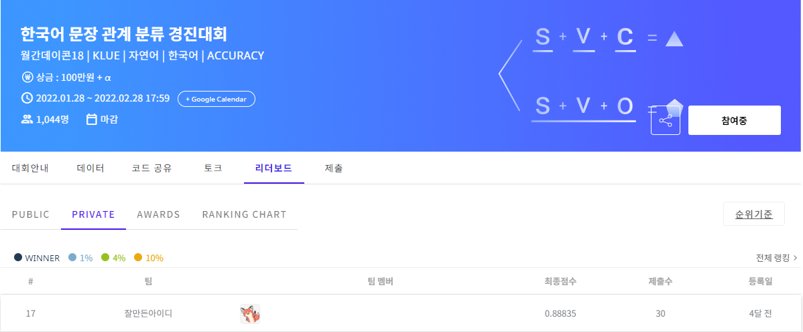
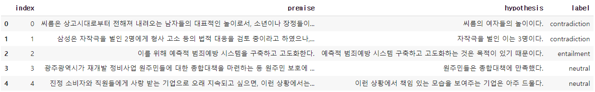
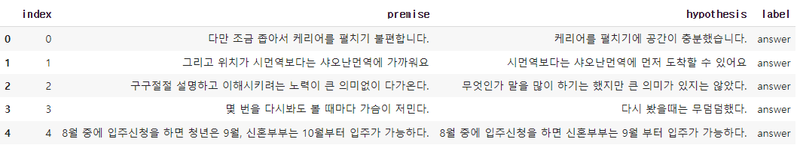

# Dacon 한국어 문장 관계 분류

결과: 리더보드 등록자 기준 468명 중 **Private 17th, accuracy 0.88835**

- Kaggle notebook gpu 환경에서 학습을 진행하였습니다.
- 데이터: 기존 학습데이터 + klue 검증데이터(기존 test셋에서 중복되는 데이터 6개 제거)
- 모델: roberta-large + self explaining structures improve NLP models를 사용하였습니다.
- 학습에는 5 fold 전략과 가중치 초기화를 적용하였습니다.

추가 데이터: https://aistages-prod-server-public.s3.amazonaws.com/app/Competitions/000068/data/klue-nli-v1.1.tar.gz
self explaing NLP: https://arxiv.org/abs/2012.01786

## 데이터 전처리

- 마침표를 제외한 특수문자가 포함되지 않은 것을 확인하였고 숫자와 영어 같은 경우에는 단위와 갯수를 다루는 문장이 있었기 때문에 제거하지 않는 것이 낫다고 판단하였습니다.
- 불용어 같은 경우에는 유사해보이는 문장이라도 조사의 차이로 관계까 달라질 수 있기 때문에 제거하지 않았습니다.
- max_len = 70

## 모델

- 모델의 경우에는 공식적인 한국어 벤치마크 데이터를 대상으로 가장 결과가 좋은 것이 klue/roberta-large 모델로 알고 있어서 이를 기준으로 활용하였고 self-explaining 에서도 roberta-large를 backbone으로 활용하여서 채택. 다만 데이터 증강을 통한 학습시간이 오래 걸려서 fold 전략을 사용하지 않거나 ko-electra와 같이 모델을 다소 가벼운걸 사용하여 적절한 hyper-parameter를 찾는 것이 더 성능이 좋지 않았을까 싶음
- https://github.com/ShannonAI/Self_Explaining_Structures_Improve_NLP_Models에 self-explaining 모델을 구현한 코드가 있습니다. 다만 페이퍼에서 언급한 loss인 ceLoss + regLoss가 아니라 ceLoss - regLoss 로 구현이 되어있어 수정하여서 사용
- 사용하는 모델에 대해서 가중치 초기화를 적용하여 성능이 소폭 상향되는 것을 확인할 수가 있었습니다.
- 이외에는 논문에서 언급한 파라미터, 툴을 그대로 사용

## 고려해볼점

- 별도의 하이퍼파라미터 튜닝을 진행하지 않았는데 해당 데이터셋에 맞게 optuna를 이용하여  하이퍼 파라미터 튜닝을 한다면 좀 더 개선될 것
- 상위 랭커의 경우, 외부학습 데이터 사용에 제한이 없었기 때문에 현재 구성된 데이터와 유사한 주제의 데이터를 많이 끌어와서 사용한 것을 볼 수 있었음

